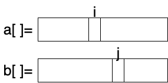

# Union if Two Sorted Array

**Input:** a[] = {13, 15, 18} </br>
b[] = {12, 18, 19, 20, 25} </br>
**Output:** c[] = {12, 13, 15, 18, 19, 20, 25}

**Input:** a[] = {12, 13, 13, 13, 14,  14} </br>
b[] = {14, 14} </br>
**Output:** c[] = {12, 13, 14}

## Naive Approach

```golang
package main

import (
	"fmt"
	"sort"
)

func main() {
	a := []int{3, 5, 10, 10, 10, 15, 15, 20}
	b := []int{5, 10, 10, 15, 30}
	res := union(a, b)
	fmt.Println(res) //[3 5 10 15 20 30]
}

func union(a, b []int) (res []int) {
	c := make([]int, len(a)+len(b))
	for i := 0; i < len(a); i++ {
		c[i] = a[i]
	}
	m := len(a)
	for j := 0; j < len(b); j++ {
		c[m+j] = b[j]
	}
	sort.Ints(c)
	for i := 0; i < len(c); i++ {
		if i == 0 || c[i] != c[i-1] {
			res = append(res, c[i])
		}
	}
	return res
}

```

**Time Complexity:** O((m+n)*log(m+n))

**Dry Run:** </br>
a[] = {3, 5, 5} </br>
b[] = {1, 5, 7, 7} </br>

After 1st loop: c[] = {3, 5, 5, _, _, _, _} </br>
After 2nd loop: c[] = {3, 5, 5, 1, 5, 7, 7} </br>
After sorting: c[] = {1, 3, 5, 5, 5, 7, 7} </br>
3rd loop: res[] = {1, 3, 5, 7} </br>

## Efficient Solution

### Implementation Idea



if i > 0 && a[i] == a[i-1] { i++; continue; } </br>
if j > 0 && b[j] == b[j-1] { j++; continue; } </br>
if a[i] < b[j] { c=append(c,a[i]); i++ } </br>
if a[i] > b[j] { c=append(c,b[j]); j++ } </br>
if a[i] == b[j] { c=append(c,a[i]); i++; j++ } </br>

### Implementation

```golang
```
